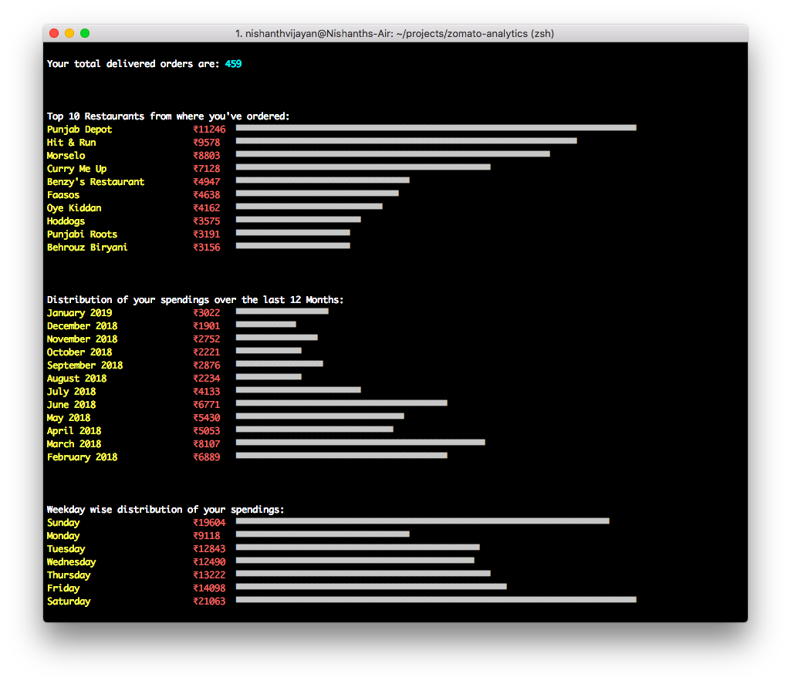

# zomato-analytics
  


`zomato-analytics` is a cli tool to help you analyse your zomato orders. This project is heavily inspired by [swiggy-analytics](https://github.com/mr-karan/swiggy-analytics).

### Warning

`zomato-analytics` needs to login to your Zomato account in order to scrape your order history. Your Zomato account username/email and password lives on your local file system. If you don't feel comfortable entering these details, you can audit the code yourself to be sure that this information is not used in any evil way.  
  
## Quickstart
Install the required dependencies by running: 
```
npm install
```

To start the script, use:
```
node index.js
```

When running the tool for the first time, you'll be prompted to enter your Zomato usernam/email & password.  

### Options
To save your orders to a json file, use the `-s` / `--save` option:
```
node index.js --save somefile.json
```


To read your orders from a json file instead of crawling zomato, use the `-i` / `--input` option:
```
node index.js --input somefile.json
```
